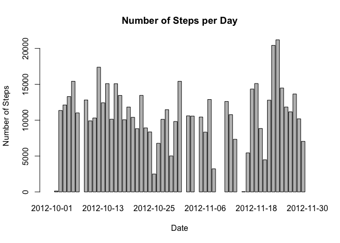
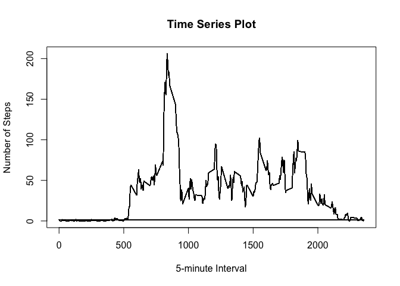
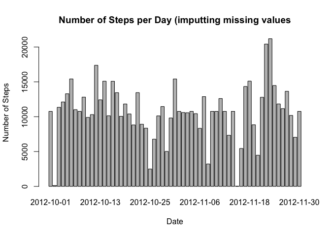
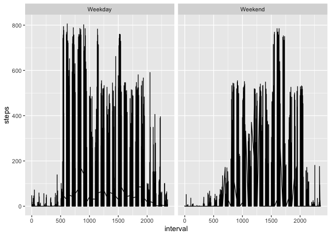

## Loading and preprocessing the data

### 1) Code for reading in the dataset and/or processing the data

We will start by loading the data into R and taking a look at it.


```r
data <- read.csv("activity.csv", na.strings = "NA" )
 str(data)
```

```
## 'data.frame':	17568 obs. of  3 variables:
##  $ steps   : int  NA NA NA NA NA NA NA NA NA NA ...
##  $ date    : Factor w/ 61 levels "2012-10-01","2012-10-02",..: 1 1 1 1 1 1 1 1 1 1 ...
##  $ interval: int  0 5 10 15 20 25 30 35 40 45 ...
```

We will also load the package dplyr to help us manipulate the data and ggplot2 for generating plots.


```r
library(dplyr)
library (ggplot2)
```


## What is mean total number of steps taken per day?

For this part of the assignment we will ignore the missing values.


```r
na.rm.data <- na.omit(data)
```

We will start by calculating how many steps are taken per day.


```r
by_date <- tapply(na.rm.data$steps, na.rm.data$date, sum)
head(by_date)
```

```
## 2012-10-01 2012-10-02 2012-10-03 2012-10-04 2012-10-05 2012-10-06 
##         NA        126      11352      12116      13294      15420
```

### 2) Histogram of the total number of steps taken each day

Next we will create a histogram.


```r
barplot(by_date, xlab = "Date", ylab = " Number of Steps", main = "Number of Steps per Day")
```

<!-- -->

### 3) Mean and median number of steps taken each day

We calculate the mean and median of the total number of steps that were taken each day within the time frame.


```r
mean <- round(mean(by_date, na.rm = TRUE))
mean
```

```
## [1] 10766
```

```r
median <- median(by_date, na.rm = TRUE)
median
```

```
## [1] 10765
```

The mean of the total number of steps taken each day is 1.0766\times 10^{4}

## What is the average daily activity pattern?

We will start by grouping the data by the 5-minute intervals and taking the average across dates.


```r
by_interval <- na.rm.data %>% group_by(interval) %>% mutate(average = mean(steps))
```

Here is the corresponding plot:

### 4) Time series plot of the average number of steps taken


```r
plot(by_interval$interval, by_interval$average, type = "l", main = "Time Series Plot", xlab = "5-minute Interval", ylab = "Number of Steps")
```

<!-- -->

### 5) The 5-minute interval that, on average, contains the maximum number of steps


```r
max <- max(by_interval$average)
int <- filter(by_interval, average == max)
head(int)
```

```
## # A tibble: 6 x 4
## # Groups:   interval [1]
##   steps date       interval average
##   <int> <fct>         <int>   <dbl>
## 1     0 2012-10-02      835    206.
## 2    19 2012-10-03      835    206.
## 3   423 2012-10-04      835    206.
## 4   470 2012-10-05      835    206.
## 5   225 2012-10-06      835    206.
## 6     0 2012-10-07      835    206.
```

```r
interval <- int[1,3] 
```

We can see that the interval that corresponds to the maximum is 835. We can also confirm "visually" by looking at the previous plot that these coordinates make sense. 


## Imputing missing values

### 6) Code to describe and show a strategy for imputing missing data

Now we will go back to our original dataset, without omiting the missing data. We start by counting the number of missing values. To do that we simply check the difference in the number of rows between the two datasets.


```r
missing <- nrow(data) - nrow(na.rm.data)
missing
```

```
## [1] 2304
```

So there are 2304 missing values.

We will imput the missing data by subsituting NA for the average number of steps (across dates) in that particular 5-minute interval. We have already calculated those averages while answering the previous questions. 


```r
my_function <- function (x) {
        v <- NULL
        for (i in 1:nrow(x)) {
                if (is.na(x[i,1]) == TRUE) {
                        it <- x[i,3]
                        av <- subset(by_interval, interval == it, select = average)[1,1]
                        v <- c(v, av)
                } else {
                v <- c(v, x[i,1])
                }
        }
        x %>% mutate(steps = v)
}
```

We created a function that loops over the column "steps" and substitutes NAs for the average number of steps in that particular interval. If it is not an NA than it maintains the original value. 

Now we will apply this function to our dataset.


```r
new_data <- my_function(data)
head(new_data)
```

```
##       steps       date interval
## 1  1.716981 2012-10-01        0
## 2 0.3396226 2012-10-01        5
## 3 0.1320755 2012-10-01       10
## 4 0.1509434 2012-10-01       15
## 5 0.0754717 2012-10-01       20
## 6   2.09434 2012-10-01       25
```

```r
head(data)
```

```
##   steps       date interval
## 1    NA 2012-10-01        0
## 2    NA 2012-10-01        5
## 3    NA 2012-10-01       10
## 4    NA 2012-10-01       15
## 5    NA 2012-10-01       20
## 6    NA 2012-10-01       25
```

```r
head(by_interval)
```

```
## # A tibble: 6 x 4
## # Groups:   interval [6]
##   steps date       interval average
##   <int> <fct>         <int>   <dbl>
## 1     0 2012-10-02        0  1.72  
## 2     0 2012-10-02        5  0.340 
## 3     0 2012-10-02       10  0.132 
## 4     0 2012-10-02       15  0.151 
## 5     0 2012-10-02       20  0.0755
## 6     0 2012-10-02       25  2.09
```

We can see that NAs have been appropriately subsituted.

We can check that when they were not NA they remained the same in some random rows:


```r
data[1000:1005,]
```

```
##      steps       date interval
## 1000     0 2012-10-04     1115
## 1001     0 2012-10-04     1120
## 1002   180 2012-10-04     1125
## 1003    21 2012-10-04     1130
## 1004     0 2012-10-04     1135
## 1005     0 2012-10-04     1140
```

```r
new_data[1000:1005,]
```

```
##      steps       date interval
## 1000     0 2012-10-04     1115
## 1001     0 2012-10-04     1120
## 1002   180 2012-10-04     1125
## 1003    21 2012-10-04     1130
## 1004     0 2012-10-04     1135
## 1005     0 2012-10-04     1140
```

### 7) Histogram of the total number of steps taken each day after missing values are imputed

We will calculate the total steps by day on the new dataset (with NAs imputted)


```r
new_data$steps <- as.numeric(new_data$steps)
new_by_date <- tapply(new_data$steps, new_data$date, sum)
head(new_by_date)
```

```
## 2012-10-01 2012-10-02 2012-10-03 2012-10-04 2012-10-05 2012-10-06 
##   10766.19     126.00   11352.00   12116.00   13294.00   15420.00
```

Here is the new histogram


```r
barplot(new_by_date, xlab = "Date", ylab = " Number of Steps", main = "Number of Steps per Day (imputting missing values")
```

<!-- -->

Now we will calculate the mean and median:


```r
new_mean <- mean(new_by_date)
new_mean
```

```
## [1] 10766.19
```

```r
new_median <- median(new_by_date)
new_median
```

```
## [1] 10766.19
```

As we can see, the mean obtained from the dataset with NAs removed was 1.0766\times 10^{4} which is almost the same as the "new" mean obtained by imputing values for NAs, 1.0766189\times 10^{4}. Same happens with the median, the median obtained without NAs was 10765 also very close to the "new" median, 1.0766189\times 10^{4}. Therefore we may conclude that imputing values for missing data, such as was done here does not impact the estimates for total number of steps per day. 

## Are there differences in activity patterns between weekdays and weekends?

### 8) Panel plot comparing the average number of steps taken per 5-minute interval across weekdays and weekends.

We will use the dataset that we created with the missing values imputted above. Let us calculate the average steps across dates.


```r
final <- new_data %>% mutate(steps = as.numeric(steps)) %>% group_by(interval) %>% mutate(average = mean(steps))
head(final)
```

```
## # A tibble: 6 x 4
## # Groups:   interval [6]
##    steps date       interval average
##    <dbl> <fct>         <int>   <dbl>
## 1 1.72   2012-10-01        0  1.72  
## 2 0.340  2012-10-01        5  0.340 
## 3 0.132  2012-10-01       10  0.132 
## 4 0.151  2012-10-01       15  0.151 
## 5 0.0755 2012-10-01       20  0.0755
## 6 2.09   2012-10-01       25  2.09
```

We will turn the date variable into class Date.


```r
final$date = as.Date(final$date)
```

Next, we create a variable called "week", that identifies which day of the week it is. 


```r
final$week <- sapply(final$date, weekdays)
```

We only want to know if it is a weekday or weekend, so we will simply change the names. 


```r
final$week <- gsub("Monday", "Weekday", final$week)
final$week <- gsub("Tuesday", "Weekday", final$week)
final$week <- gsub("Wednesday", "Weekday", final$week)
final$week <- gsub("Thursday", "Weekday", final$week)
final$week <- gsub("Friday", "Weekday", final$week)
final$week <- gsub("Saturday", "Weekend", final$week)
final$week <- gsub("Sunday", "Weekend", final$week)
```


```r
qplot(interval, steps, data = final, facets = . ~ week, geom = "line")
```

<!-- -->

As we can see there are some differences between weekdays and weekends. Though the maximum number of steps is about the same. The time interval when we begin to see an increase in number of steps is greater then weekdays, which tells us that the person tends to start moving later in the day than on weekdays. The peaks also happen later in the day. 


